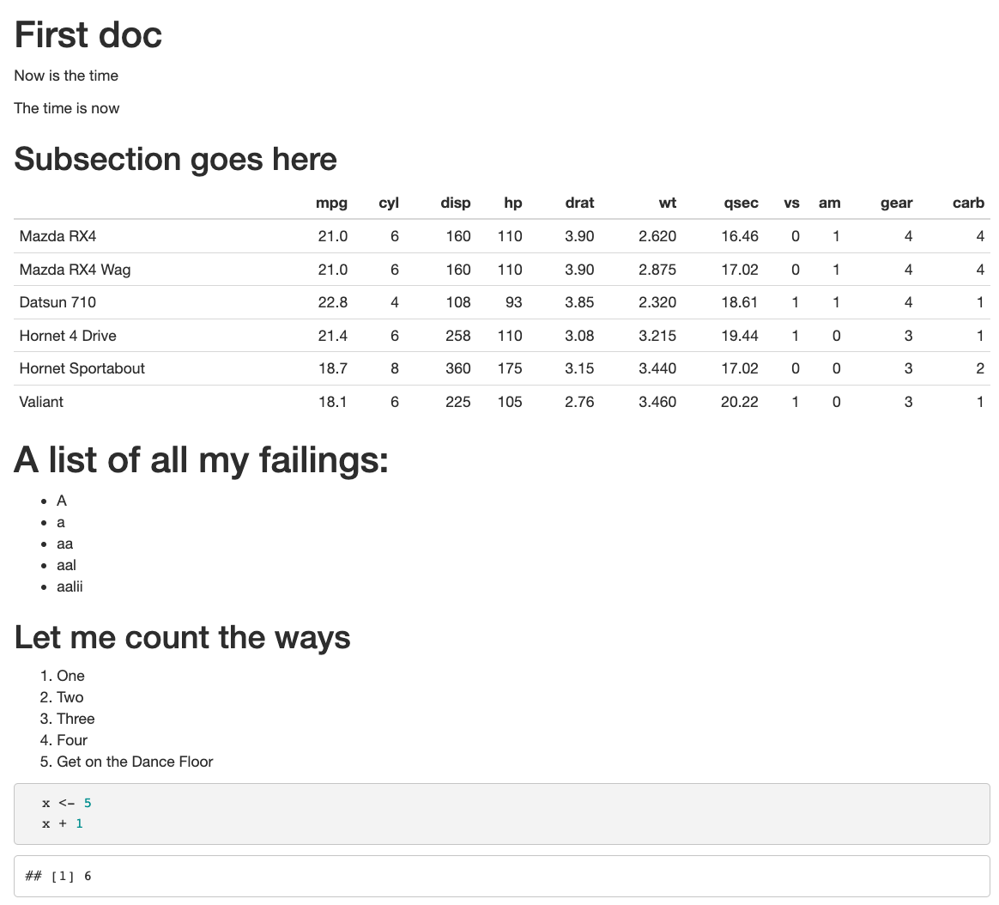
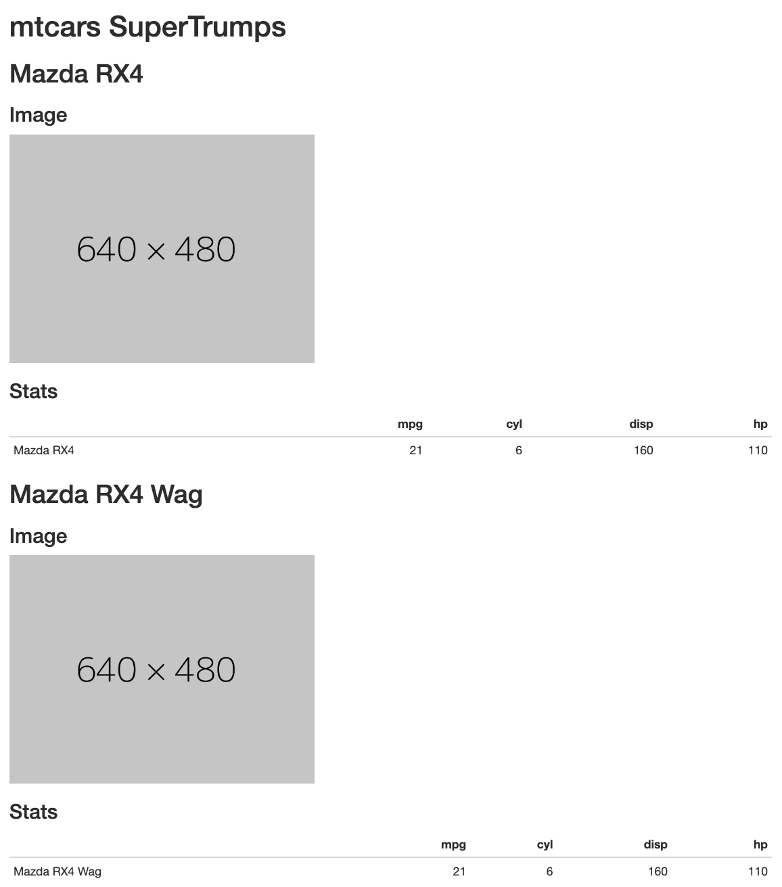

<!-- README.md is generated from README.Rmd. Please edit that file -->

```{r, include = FALSE}
knitr::opts_chunk$set(
  collapse = TRUE,
  comment = "#>",
  fig.path = "man/figures/README-",
  out.width = "100%"
)

library(moggy)
```

# moggy 

<!-- badges: start -->


<!-- badges: end -->

`{moggy}` is a package for creating markdown documents from scratch without 
using a template.

My use-case for this package is to create markdown documentation directly 
from meta-information.

The completion of this package is proportional to the quality of the cat image
in the logo.


## Installation

You can install from [GitHub](https://github.com/coolbutuseless/moggy) with:

``` r
# install.package('remotes')
remotes::install_github('coolbutuseless/moggy')
```

## Example


```{r example, collapse = FALSE, comment = ""}
library(moggy)

doc <- MarkdownDoc$new()
doc$h1("First doc")
doc$add("Now is the time\n\nThe time is now")
doc$h2("Subsection goes here")
doc$table(head(mtcars))
doc$h1("A list of all my failings:")

words <- readLines("/usr/share/dict/words", n = 5)
doc$itemize(words)

doc$h2("Let me count the ways")
doc$enumerate(c("One", "Two", "Three", "Four", "Get on the Dance Floor"))
doc$code(r"(
  x <- 5
  x + 1
)"
)

doc
```


#### Save to file and then render/knit

```{r eval=FALSE}
writeLines(doc$as_character(), "working/temp.Rmd")
```




## Example: Programmatic document creation

Generating some reference documentation for a [Top Trumps](https://en.wikipedia.org/wiki/Top_Trumps) game based upon 
the `mtcars` dataset.

```{r eval=FALSE}
library(moggy)
doc <- MarkdownDoc$new()
doc$h1("mtcars SuperTrumps")

for (i in 1:3) {
  doc$h2(rownames(mtcars)[i])
  doc$h3("Image")
  doc$add("")
  doc$h3("Stats")
  doc$table(mtcars[i, 1:4])
}

writeLines(doc$as_character(), "working/temp.Rmd")
```




## Related Software

* [tinkr](cran.dev/tinkr)
* [parsemd](cran.dev/parsemd)

## Acknowledgements

* R Core for developing and maintaining the language.
* CRAN maintainers, for patiently shepherding packages onto CRAN and maintaining
  the repository
